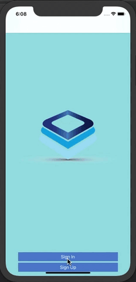

# ChatUI
ChatUI is a note-taking application.
## Current progress
Data is synchronized with Realm database. However, it is not backed up to Firebase yet.
## Features
* Display the list of notes
* Add new notes
* Edit notes
* Sign in an active account and sign up a new account
* Upload users profile picture
* Update users information
## App Architecture
### Project structure
* Reusable: Custom components and extensions.
* Assests
* App: App-level objects, which only App/Scene delegate and containers should have direct access to.
* Modules: Every scene is a module, which includes its own data, domain and UI layers.
### Dependency Injection
A container is responsible for injecting dependencies into every objects in the module then return its view controller and navigation.
* App Dependency Container: contains all long-lived dependencies. The container lives as long as the app lives, held by AppDelegate.
* Module Dependency Container: contains module-level dependencies, takes App Dependency Container as init parameter. The container lives as long as the view controller lives, held by View Model through Navigation class-bound protocol.
\

## Built with
* [RxSwift](https://github.com/ReactiveX/RxSwift/)
* [Realm Database](https://github.com/realm/realm-cocoa/)
* [RxRealm](https://github.com/RxSwiftCommunity/RxRealm)
* [Firebase](https://firebase.google.com/)
